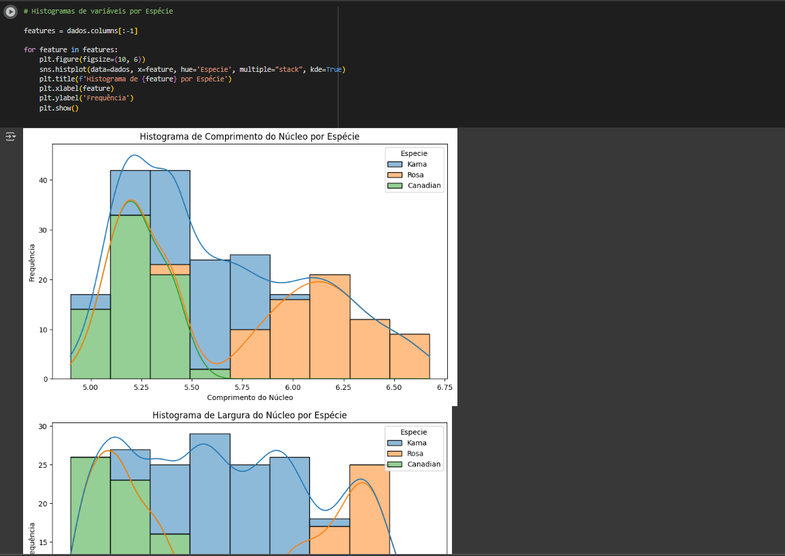
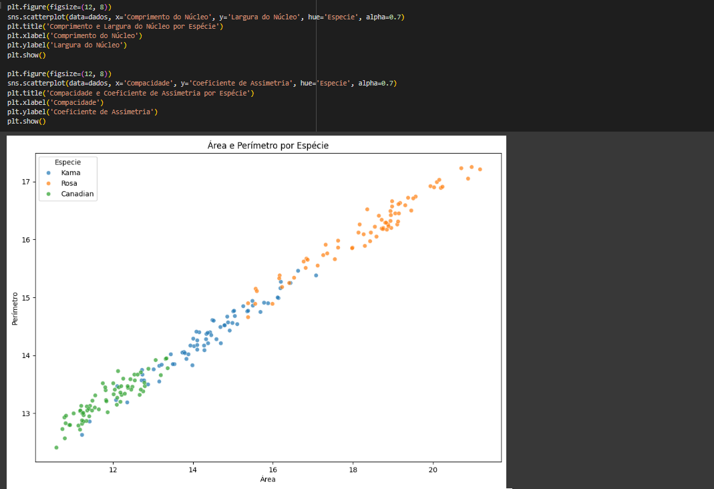
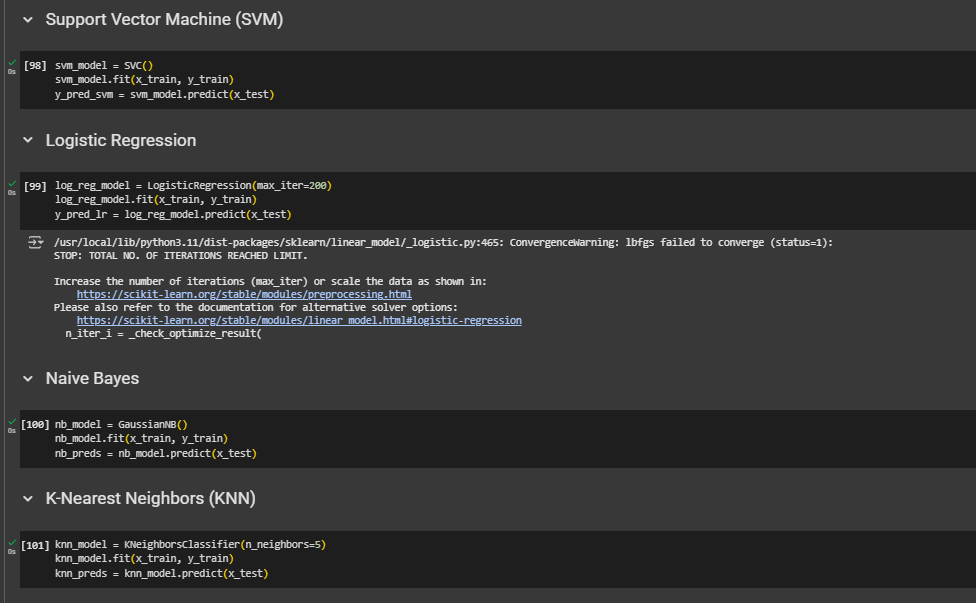

# FIAP - Faculdade de Informática e Administração Paulista

 

# Cap 3 - (IR ALÉM) Implementando algoritmos de Machine Learning com Scikit-learn

|        Grupo             |                   RM                   |
|:------------------------:|:--------------------------------------:|
| **Arthur Luiz Rosado Alves** | RM562061                          |
| **Renan de Oliveira Mendes** | RM563145                          |

# Análise e Modelos

Nesse trabalho realizamos uma análise e tratamento dos dados do Dataset "Seeds" em UCI Machine Learning Repository: <https://archive.ics.uci.edu/dataset/236/seeds>.
Realizamos análises gráficas

</a>

</a>

Separamos os dados em treino e testes, e utilizamos cinco modelos para prever a classe de cada semente:

K-Nearest Neighbors (KNN);
Support Vector Machine (SVM);
Random Forest;
Naive Bayes;
Logistic Regression.

</a>

